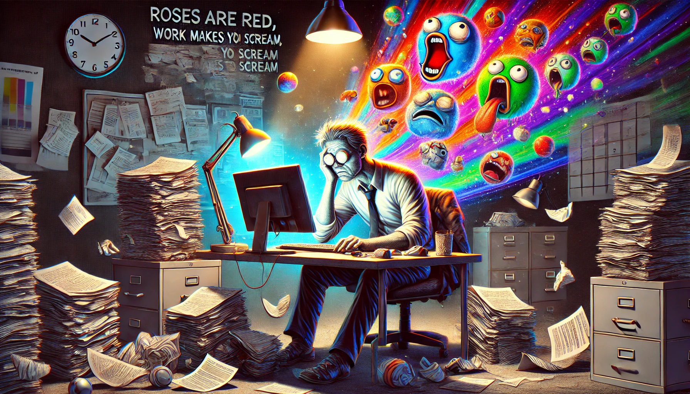

# Quotes. Visualized.

| Quote | Realization |
| ------- | ----- |
| when you lay down outside, looking up at the sky, you are actually staring down an infinite cosmic abyss with only the earth's gravity stopping you from drifting off forever. |  |
| It's the nature of time that the old ways must give in. It's the nature of time that the new ways come in sin. When the new meets the old, it always ends the ancient ways. And as history told the old ways go out in a blaze. |   |
| Roses are red, work makes you scream, I used to have dreams, now I have memes. |   |
| Where is the Life we have lost in living? Where is the wisdom we have lost in knowledge? Where is the knowledge we have lost in information? |    |

