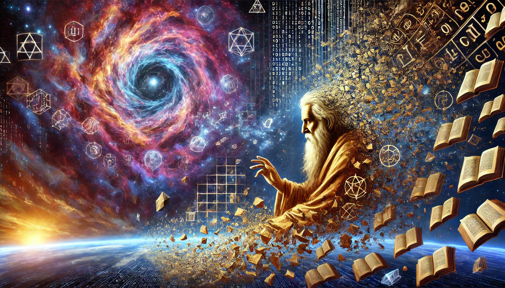

# Quotes. Visualized.

| Quote | Realization |
| ------- | ----- |
| when you lay down outside, looking up at the sky, you are actually staring down an infinite cosmic abyss with only the earth's gravity stopping you from drifting off forever. |  |
| It's the nature of time that the old ways must give in. It's the nature of time that the new ways come in sin. When the new meets the old, it always ends the ancient ways. And as history told the old ways go out in a blaze. |   |
| Roses are red, work makes you scream, I used to have dreams, now I have memes. |   |
| Where is the Life we have lost in living? Where is the wisdom we have lost in knowledge? Where is the knowledge we have lost in information? |    |
| If you can keep your head when all about you
Are losing theirs and blaming it on you;
If you can trust yourself when all men doubt you,
But make allowance for their doubting too:
If you can wait and not be tired by waiting,
Or being lied about, don’t deal in lies,
Or being hated, don’t give way to hating,
And yet don’t look too good, nor talk too wise;

If you can dream—and not make dreams your master;
If you can think—and not make thoughts your aim,
If you can meet with Triumph and Disaster
And treat those two impostors just the same:
If you can bear to hear the truth you’ve spoken
Twisted by knaves to make a trap for fools,
Or watch the things you gave your life to, broken,
And stoop and build ’em up with worn-out tools;

If you can make one heap of all your winnings
And risk it on one turn of pitch-and-toss,
And lose, and start again at your beginnings
And never breathe a word about your loss:
If you can force your heart and nerve and sinew
To serve your turn long after they are gone,
And so hold on when there is nothing in you
Except the Will which says to them: “Hold on!”

If you can talk with crowds and keep your virtue,
Or walk with Kings—nor lose the common touch,
If neither foes nor loving friends can hurt you,
If all men count with you, but none too much:
If you can fill the unforgiving minute
With sixty seconds’ worth of distance run,
Yours is the Earth and everything that’s in it,
And—which is more—you’ll be a Man, my son! |  |

